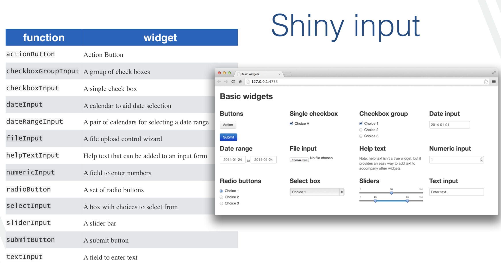

 <style>
 .title-slide {
     background-image: url(logoclass.png);
     background-repeat: no-repeat;
     padding:40px;
     background-position: 90% 80%;
     background-size: 100px 100px;
   }
   </style>


```{r setup, include=FALSE}
knitr::opts_chunk$set(echo = TRUE, fig.pos = 'hbpt', out.extra = '', message = FALSE, warning = FALSE)
```


## <span style = "color:#883984">Sobre mi</span>
.pull-left[  
- Instituto de Estadística-Universidad de la República (IESTA-UDELAR), Montevideo Uruguay.

- PhD y Msc. en Estadística en Iowa State University, USA

- Intereses: aprendizaje supervisado, estadística computacional, visualización estadística y ciencia de datos.

- Co-fundadora of R-Ladies Ames,  R-Ladies Montevideo, GURU::MVD y [LatinR Conference](https://latin-r.com) tiempo para mandar trabajos hasta el 17 de Julio.


]

.pull-right[


Contact info: 

email: natalia.dasilva@fcea.edu.uy

twitter: @pacocuak

webpage: http://natydasilva.com

]

---


## <span style="color:#88398A"> Sobre la charla </span> 

- Slides: https://natydasilva.github.io/ISI_workshop/


- Monday 22 to Wednesday 24, 9:00 to 11:30 UTC-3 
 
  - Session 1: 09.00 – 10.30 
  
  - Session 2: 10.45 – 11.30


---

## <span style="color:#88398A"> Qué es `shiny`? </span>

 - `shiny` es un paquete de R que nos permite crear applicaciones interactivas web
 
 - Uno puede crear aplicaciones web complicadas sin saber, HTML, JavaScript o CSS.
 
 - El código puede ser realizado completamente en R  (o personalizado en HTML/JavaScript)
 
 - Galería de RStudio sobre `shiny`  http://shiny.rstudio.com/gallery/
 
 - Versión más actualizada: https://github.com/rstudio/shiny
 
---

## <span style="color:#88398A"> Documentación y ayuda para `shiny` </span>
 
 
- Tutoriales de RStudio http://shiny.rstudio.com/tutorial/

- Libro fines 2020 https://mastering-shiny.org

- Lista de correos de `shiny` https://groups.google.com/forum/#!forum/shiny-discuss 

- Si querés tener tu `shiny` en un servidor web: http://shiny.rstudio.com 


---

## <span style="color:#88398A">Componentes claves de una shiny</span>

- `ui`: "user interface" (interface de usuario), documento web en html (no necesito saber html lo hago desde R). Define como se ve la app.

- `server`: Define como la app funciona. Conjunto de instrucciones seguidas por el servidor cuando cambia el `input`

- Las expresiones reactivas son el tercer componente clave, veremos más adelante.
 
---

## <span style="color:#88398A">Reactividad</span>

Cuando construyo una `shiny`, siempre debemos pensar en `inputs` y `outputs` 

- Las aplicaciones shiny usan **programación reactiva**

 **programación reactiva**: permite automáticamente actualizar los `outputs` cuando cambian los `inputs`

- Valor del `input`  => código R  => valor del `output` 

---

## <span style="color:#88398A">Ejemplo inicial </span>


---

## <span style="color:#88398A">Ejemplo shiny app</span>
Necesitamos el paquete `shiny` 

Creá un nuevo directorio y agregá el archivo app.R que contiene la app. 

```{r, echo=TRUE, eval=FALSE}
library(shiny)
runApp("shiny/app.R")
```

Esta aplicación es la que surge por defecto cuando selecciono

File | New Project y selecciono New Directory y Shiny Web Application.
---

## <span style="color:#88398A">Ejemplo shiny app</span>

```{r, eval=FALSE}
ui <- fluidPage(
   
   # Título de la aplicación
   titlePanel("Datos del géiser old faithful)"),
   
   # Barra lateral con control deslizante para el número de bins 
   sidebarLayout(
      sidebarPanel(
         sliderInput("bins",
                     "Número de bins:",
                     min = 1,
                     max = 50,
                     value = 30)
      ),
      
      # Muestro el gráfico de la distribución generada
      mainPanel(
         plotOutput("distPlot")
      )
   )
)
```
---


## <span style="color:#88398A">Ejemplo shiny app</span>

```{r, eval=FALSE}

# Definimos en el server la lógica requerida para dibujar el histograma
server <- function(input, output) {
   
   output$distPlot <- renderPlot({
      # generamos los bins basados en input$bins de ui.R
      x    <- faithful[, 2] 
      bins <- seq(min(x), max(x), length.out = input$bins + 1)
      
      # dibujamos el histograma con el número especificado de bins
      hist(x, breaks = bins, col = 'darkgray', border = 'white')
   })
}

# Corremos la aplicación
shinyApp(ui = ui, server = server)
```
---
## <span style="color:#88398A">Baby shiny app</span>
En el archivo app.R escribí el siguiente código

```{r, echo=TRUE, eval=FALSE}

library(shiny)
ui <- fluidPage(
  "Mi primera shiny app!"
)
server <- function(input, output){
  
}

shinyApp(ui, server)

```
- Corré el código
---


## <span style="color:#88398A">Baby shiny app</span>
Qué hace nuestro código?

1. Cargamos la librería `shiny`
2. `ui` define la interface de usuario, la página web en HTML donde las personas interactuan. En este caso en nuestra web pusimos "Mi primera shiny app!".
3. Definimos lo que hace la app en la función `server`. En este caso no hace nada porque está vacía.
4. Ejecutamos `shinyApp(ui, server)` que construye e inicializa la app desde el UI y el server

---

## <span style="color:#88398A">Baby shiny app</span>


---

## <span style="color:#88398A">Correr la app y frenarla</span>
Para correr:
- usando Run app en RStudio
- Ctrl + Shift + Enter
-  `shiny::runApp()`

Para frenar:
- Presiono el signo de stop en la consola
- Presiono Esc en la consola
- Cierran la pestaña de la app
---

## <span style="color:#88398A">Shiny input y outputs </span>
- `input`: recolecta los valores que el usuario decide
- `output`: las respuestas que observo cuando cambio un input, ejemplo un gráfico

Se agregan elementos a la app como argumentos de `fluidPage()`
```{r, eval=FALSE, echo=TRUE}
ui <- fluidPage(
  #* Input() functions,
  #*  Output() functions
  
)
```
`fluidPage()` es una función de diseño (layout function) que determina la estructura básica de la página
---


## <span style="color:#88398A">Shiny input y outputs </span>
```{r, eval=FALSE,echo=TRUE}
ui <- fluidPage(
sliderInput(inputId = "cant",
                     label = "Tamaño muestral:",
                     min = 1,
                     max = 50,
                     value = 30)
  
)
server <- function(input, output){}
shinyApp(ui, server)
```

`sliderInput` es un input de control que permite al usuario interactuar con la app dando un valor definido en un rango.
---


## <span style="color:#88398A">Shiny input </span>


---

## <span style="color:#88398A">Sintaxis para input </span>

- `sliderInput( inputId = “num”, label = “Number of
observations”, ...)`

- `inputId` es el nombre interno, tiene que ser una etiqueta única

- `label`  se muestra como la etiqueta de la ventana  

`...` parámetros específicos para distintos `inputs`, por ejemplo `sliderInput` tiene `min` y `max`

---


## <span style="color:#88398A">Shiny output </span>


---
## <span style="color:#88398A">Sintaxis para output </span>

- plotOutput( outputId = “hist” )

- `outputId` es un nombre interno que debe ser único 


```{r, echo=TRUE, eval=FALSE}
ui <- fluidPage(
sliderInput(inputId = "cant",
                     label = "tamaño muestral:",
                     min = 1,
                     max = 500,
                     value = 30),
plotOutput(outputId = "hist")
  
)
server <- function(input, output){}
shinyApp(ui, server)
```
---

## <span style="color:#88398A">Sintaxis para output </span>

- Parece no haber diferencia pero detrás en el html que se genera hay un espacio reservado para un gráfico. 

- Solamente agregamos el nombre del gráfico pero aún no especificamos que tipo de gráfico quiero.

- Para especificar el tipo de gráfico tenemos que especificarlo en la función `server`.

---

## <span style="color:#88398A">Recapitulando </span>

- Iniciar cada shiny con el mismo código minimal del inicio (baby shiny)

- Agregá nuevos elementos como argumentos de `fluidPage()` 

- Creá `inputs` reactivos con una función `*Input()` 

- Mostrá resultados reactivos con la función `*Output()` 

- Usá la función `server` para conectar `inputs` con `outpus`
---


## <span style="color:#88398A">Función `server` </span>
La funcion `server` conecta los `inputs` con los `outputs` 

Hay tres reglas básicas para escribir la función `server`
---


## <span style="color:#88398A"> `server` regla 1</span>

**Si constuímos un objeto `output` debemos guardarlo en `output$hist`, se llama `hist` porque así se llama el gráfico que quiero mostrar `plotOutput(outputId = "his")`**

---

## <span style="color:#88398A"> `server` regla 2</span>
**Construir objetos que se muestran con `render{tipo}`**

 Las funciones `render` se crean  para producir `outputs` de diferente tipo (ej: texto,tablas y figuras) que son traducidos a html. 
 
Estas funciones son a menudo pareadas con funciones `{tipo}Output` Ejemplo `renderPrint()` con  `verbatimTextOutput()` para mostrar resumenes estadísticos con ancho fijo.  `renderTable()` con `tableOutput()` para mostrar los datos de `input` en una tabla.

`renderPlot` hace un gráfico reactivo que es adecuado para asignar a un `output`.
```{r,echo=TRUE, eval=FALSE}
server <- function(input, output) { 
output$hist <- renderPlot({(hist(rnorm(500)))
  }) 
}


```
---

## <span style="color:#88398A"> `server` regla 3 </span>

**Usar el valor `input` con `input$`**

Si queremos que algo cambie cunado se selecciona un `input`. Acá está la reactividad en acción

```{r, echo=TRUE, eval=FALSE}

server <- function(input, output){
  output$hist <- renderPlot({hist(rnorm(input$cant))})
}

```
La dependencia es creada impicitamente porque  usamos `input$cant` al interior de una función `output`. `input$cant` es usada con el valor por defecto en UI y se actualizará automaticamente cuando el valor cambie. Esta es la clave de la reactividad, los  `outputs` se recalculan cuando cambian los `inputs`.


---

## <span style="color:#88398A">Funciones `render*()` </span>

---

## <span style="color:#88398A">SHINY</span>

```{r, echo=TRUE, eval=FALSE}

ui <- fluidPage(
sliderInput(inputId = "cant",
                     label = "tamaño muestral:",
                     min = 1,
                     max = 500,
                     value = 30),
plotOutput(outputId = "hist")
  
)
server <- function(input, output){
  output$hist <- renderPlot({
    hist(rnorm(input$cant))
    })
}
shinyApp(ui, server)

```
---

## <span style="color:#88398A">Recapitulando server </span>

- Usá el server para conectar inputs y outputs
- 3 reglas, guardar los outputs que se construyen en `output$`, construí el objeto `output` con una función `render*()`, accedé a los valores generados en input con `input$` 

Si seguimos estas reglas la shiny va a usar los Inputs para crear Outputs reactivos
---


<!-- ## <span style="color:#88398A">Tu Turno, Actividad 11 </span> -->
<!-- Subir a su repo -->

<!-- 1) Modificá la shiny para que el histograma sea un ggplot2 -->

<!-- 2)  Agregá un input para cambiar la media y el desvío standard -->

<!-- 3)  Agregá  un input para simular de una distribución gamma `rgamma` y una normal. -->

